# PHONOWORLD — MASTER ARCHITECTURE & ENGINEERING PLAN
**Version:** 1.0.0-PROD  
**Status:** Approved Source of Truth  
**Target Category:** Consumer Electronics Discovery, Specifications, Price Tracking, Comparison & Recommendation Engine (Starting with Smartphones in India)  
**Primary Tech Stack:** TypeScript, React (Vite/SSR-Ready), Tailwind CSS, Node.js (Express), MongoDB (Mongoose), Redis (BullMQ), Meilisearch / Atlas Search  
**Target Marketplace:** India (`Amazon.in`, `Flipkart`, `Croma`, `Reliance Digital`, `Vijay Sales`, Direct-to-Consumer / OEM Stores)

---

## 1. Executive Summary

PhonoWorld is a high-performance consumer technology discovery, structured specification, price aggregation, product comparison, user review, and intelligent recommendation platform tailored specifically for the Indian electronics ecosystem.

While existing platforms like *91mobiles*, *Smartprix*, *Gadgets 360*, and *GSMArena* dominate organic search, they suffer from significant modern UX deficiencies: cluttered ad-heavy layouts, opaque scoring algorithms, sluggish client performance, inconsistent variant-level pricing, and lack of contextual, transparent recommendation logic.

PhonoWorld is engineered to bridge these gaps through:
1. **Canonical Product & Variant Modeling:** Eliminating the ambiguity between base devices, storage/RAM variants, and retailer SKUs.
2. **Transparent, Multi-Attribute Scoring Engine:** Explaining *why* a device scores an 8.6/10 across 8 explicit dimensions (Performance, Display, Camera, Battery, Software, Build, Connectivity, Value) instead of presenting black-box numbers.
3. **Legitimate, Multi-Tiered Data Sourcing & Ingestion Pipeline:** Starting from a zero-cost, manually audited bootstrapping layer (100–500 curated devices), expanding into automated OEM spec ingestion and official affiliate/creator APIs (`Amazon Creators / PA-API`, `Flipkart Affiliate / Infix / Cuelinks`).
4. **Sub-100ms Search & Comparison UX:** Delivering faceted exploration, instantaneous side-by-side spec differential highlighting, and interactive radar comparisons.
5. **Mobile-First, Ad-Clean Experience:** Built with modern web standards, strict Core Web Vitals optimization (LCP < 1.8s, CLS < 0.05), and rich semantic JSON-LD structured data for dominant SEO discovery.

This Master Plan establishes the architectural, data, engineering, security, legal, and operational foundation for PhonoWorld for the next 12 to 24 months.

---

## 2. Product Vision & Mission

### Vision
To be India's most trusted, transparent, and lightning-fast consumer technology intelligence engine, enabling 100 million buyers to make confident, regret-free purchasing decisions across every consumer tech category.

### Mission
1. Structure and verify complex electronic specifications into human-digestible insights.
2. Provide transparent, real-time price tracking and historical price discovery across all major Indian retail channels without biased sponsored rankings.
3. Deliver explainable, constraint-driven product recommendations tailored to Indian consumer budgets, regional networks (5G bands), and real-world usage patterns.

### Product Principles
* **Accuracy Above All:** An unverified spec is worse than a missing spec. Every canonical field carries a confidence score and source audit trail.
* **Radical Transparency:** Clear separation between editorial rankings, algorithmic recommendations, and affiliate monetization. Zero hidden sponsored bias.
* **Speed as a Feature:** Instant client transitions, optimistic UI updates, aggressive edge caching, and lightweight bundle delivery.
* **Contextual Indian Relevance:** Native modeling of Indian retail realities (exchange offers, bank instant discounts, UPI cashbacks, regional 5G band support, charger-in-box status).

---

## 3. Product Goals & Success Metrics

| Dimension | MVP Goal (Month 1–3) | V1 Goal (Month 4–6) | Scale Goal (Month 12+) |
| :--- | :--- | :--- | :--- |
| **Catalog Depth** | 250 curated smartphones (Top 90% Indian sales volume) | 1,000 active smartphones + tablets | 10,000+ devices across Smartphones, Laptops, Audio, Wearables |
| **Search Latency** | < 80ms p95 (Meilisearch / Atlas Search) | < 50ms p95 | < 30ms edge cached |
| **Page Speed (LCP)** | < 2.0s on 4G Mobile | < 1.5s on 4G Mobile | < 1.2s Core Web Vital |
| **Data Freshness** | Daily manual + scheduled price scrape for Top 50 | Hourly price checks for active listings via APIs | Sub-15 min webhook + worker updates for tracked alerts |
| **SEO Indexation** | 100% indexation of canonical PDPs, 0 duplicate penalty | Top 10 rank for long-tail ("*phone name* price in India") | Top 3 rank for high-intent comparison & budget keywords |
| **User Engagement** | > 2.5 min session duration, 3.5 pages/session | > 4.0 min session duration, 5.0 pages/session | > 20% registered user return rate (Alerts & Wishlists) |

---

## 4. Target Users, Personas & User Journeys

### User Personas

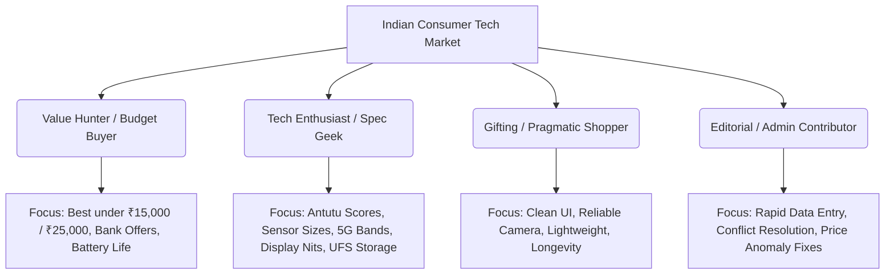

### Detailed User Journeys

#### User Journey 1: Value Hunter buying under ₹20,000
1. Lands on `/smartphones-under-20000` from Google Search.
2. Sees pre-filtered list ranked by **PhonoWorld Value Score**.
3. Toggles quick filters: *5G Enabled*, *AMOLED Display*, *Min 8GB RAM*.
4. Clicks "Best Overall" device (e.g., *iQOO Z9* vs *Nothing Phone 2a*).
5. Observes effective price breakdown: MRP ₹23,999 $\rightarrow$ Sale Price ₹19,999 $\rightarrow$ ₹1,500 HDFC Card Instant Discount = **₹18,499**.
6. Clicks outbound affiliate CTA to retailer with highest stock confidence.

#### User Journey 2: Spec Geek comparing 2 to 4 Flagships
1. Searches "Galaxy S24 vs OnePlus 12 vs Xiaomi 14".
2. Navigates to `/compare/samsung-galaxy-s24-vs-oneplus-12-vs-xiaomi-14`.
3. Activates **"Highlight Differences Only"** toggle to hide identical specs (e.g., 5G support, Bluetooth 5.3).
4. Reviews Radar Chart comparing Camera vs Battery vs Raw Performance.
5. Inspects low-level spec diffs: Sony LYT-808 (1/1.4") vs Samsung GN3 (1/1.57"), LTPO 1-120Hz vs LTPS.
6. Exports or shares comparison URL with permalink hash.

#### User Journey 3: Deal Tracker setting Price Drop Alert
1. Finds *iPhone 15 (128GB)* currently priced at ₹65,999.
2. Views Price History graph: Lowest was ₹58,999 during Great Indian Festival.
3. Clicks "Set Price Drop Alert" $\rightarrow$ Sets target price to ₹59,999.
4. Enters email or logs in via Google One-Tap.
5. System background worker evaluates price updates $\rightarrow$ When price hits ₹58,499 on Flipkart, sends instant transactional email with direct affiliate checkout link.

#### User Journey 4: Phone Finder Wizard (Multi-Attribute Recommendation)
1. User enters `/phone-finder`.
2. Answers 4 guided questions:
   - Budget slider: ₹20,000 – ₹30,000
   - Primary usage: 40% Gaming, 40% Camera, 20% Battery
   - Brand preference: Exclude Xiaomi, Prefer Motorola / OnePlus
   - Hard requirements: NFC, Clean Software
3. Scoring engine filters candidate pool, applies weighted utility functions, and outputs Top 3 picks with human-readable rationale:
   - *Why this match:* "Highest Antutu score (880k) in this budget with Clean Hello UI."
   - *Compromises:* "Lacks ultra-wide 4K video recording."

#### User Journey 5: Admin Adding & Verifying a New Launch
1. Admin opens `/admin/products/new`.
2. Pastes official OEM spec sheet URL or uploads JSON payload.
3. Ingestion parser normalizes fields automatically (e.g., converts "6.67 inch FHD+ 120Hz pOLED" into structured fields).
4. System highlights 2 low-confidence fields (e.g., 5G band count unverified).
5. Admin verifies against official PDF spec sheet, inputs verified bands (`n1, n3, n5, n8, n28, n77, n78`), and publishes.
6. Incremental Static Revalidation (ISR) / Cache purge triggers; sitemap and Meilisearch index update in < 2 seconds.

---

## 5. Competitive Landscape

| Competitor | Strengths | Severe Weaknesses / Pain Points | PhonoWorld Strategic Moat & Differentiation |
| :--- | :--- | :--- | :--- |
| **91mobiles** | Massive Indian SEO dominance, extensive retail price feeds, established brand. | Aggressive intrusive ads, cluttered layout, opaque "91mobiles Spec Score", inaccurate variant matching, slow mobile web rendering. | Clean modern aesthetic, zero intrusive interstitial ads, open transparent scoring formula, precise SKU/variant pricing breakdown. |
| **Smartprix** | Excellent comparison matrix, fast filter system, direct seller links. | Visual clutter, poor editorial context, generic review summaries, inconsistent mobile UX, limited explanation of *why* products differ. | Interactive comparison with difference highlighting, automated spec-diff summarization, guided buying wizard. |
| **GSMArena** | Gold standard in global hardware specifications, deep community, lab tests. | Not optimized for Indian retail reality (missing Indian pricing, bank discounts, regional variants), outdated desktop-first web layout. | 100% Indian market specialization (Bank offers, exchange value estimates, Indian 5G band coverage, local service center ratings). |
| **Gadgets 360** | Strong news authority, reputable editorial staff, NDTV syndication. | Weak comparison UX, rigid filtering tools, product catalog often delayed for budget Chinese releases. | Ultra-agile catalog updates, dedicated phone finder wizard, dynamic user review verification pipeline. |
| **MySmartPrice** | Strong historical price charts, offline retail price discovery. | Shifted heavily towards news/deals aggregation, reduced focus on technical spec purity and deep comparison metrics. | Deep spec granularity (PWM dimming frequencies, sensor models, memory bus speeds) paired with robust price history graphs. |
| **Cashify** | Direct buyback pricing, refurbishment ecosystem. | Heavy commercial focus on used phone sales rather than unbiased discovery of new products. | Pure buyer advocate: unbiased comparison across both new retail channels and buyback price estimators. |

---

## 6. Feature Matrix & Priority Grid

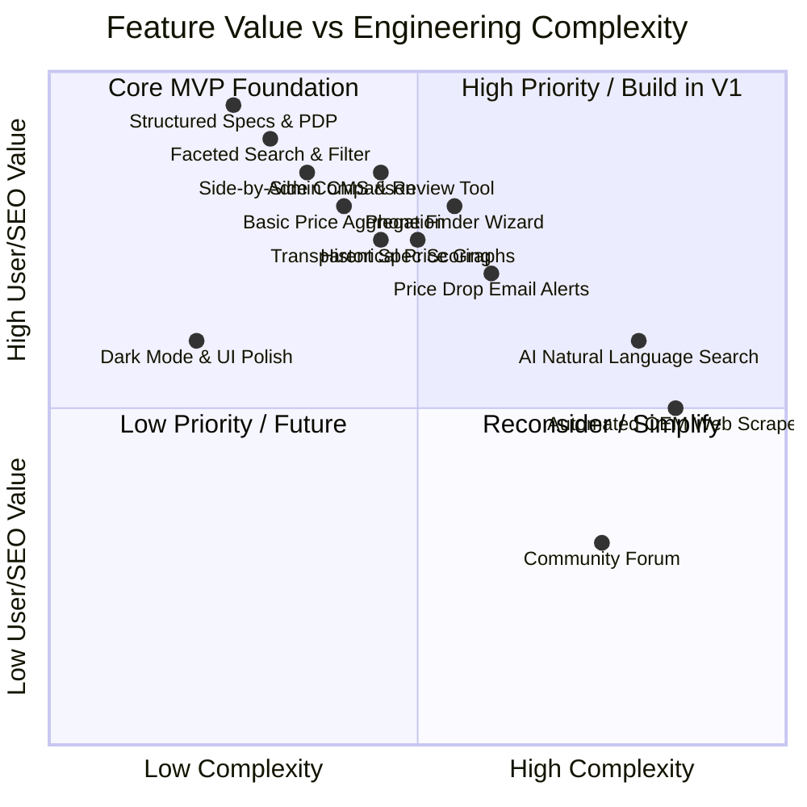

### Categorized Feature Inventory

#### MVP (Phase 1–4)
* Canonical Product, Variant, and Brand database schema.
* High-density, mobile-optimized Product Detail Page (PDP) with responsive media gallery.
* Faceted search with real-time URL synchronization (`?price=10000-20000&ram=8gb&brand=samsung`).
* 2–4 Phone Side-by-Side Comparison Engine with "Show Differences Only" filter.
* Transparent Spec Scoring algorithm (0–100 calculated across 8 hardware sub-scores).
* Retailer Offer Display (Amazon India, Flipkart, Direct OEM) with manual/semi-automated price inputs.
* Admin CMS for CRUD operations on Brands, Products, Variants, and Offers.
* Schema.org JSON-LD generation (`Product`, `Offer`, `AggregateRating`, `BreadcrumbList`).

#### Version 1.0 (Phase 5–8)
* User authentication (JWT + Google OAuth 2.0 / One-Tap).
* Interactive Price History visualizer (30d, 90d, 180d, 1yr charts via Chart.js / Recharts).
* Price Drop Alert engine with automated transactional email notifications (Resend / NodeMailer).
* Guided "Phone Finder" recommendation questionnaire with explainable match percentages.
* User Review and Rating submission with anti-spam moderation queue and verified purchase flags.
* Meilisearch full-text search integration with typo tolerance and instant autocomplete overlay.
* Wishlist and Saved Comparisons functionality.

#### Version 2.0 (Phase 9–12)
* Automated price ingestion worker leveraging Amazon Creators / PA-API and affiliate network feeds.
* Bank discount & card offer calculation engine (e.g., "10% instant discount up to ₹1,500 on ICICI cards").
* AI-assisted natural language query processing (e.g., "best battery phone under 25k with clean OS").
* Alternative Product & Upgrade Path suggestion algorithm.
* Editorial Article & Buying Guide CMS with interactive product embed cards.

#### Future Expansion (Phase 13+)
* Multi-category rollout: Laptops, Tablets, Smartwatches, Smart TVs, TWS Earbuds.
* Offline retail store availability and local price crowd-sourcing.
* Community ownership long-term durability reports and battery degradation trackers.

---

## 7. Free-First MVP & Bootstrapping Strategy

To guarantee rapid execution without upfront external API subscriptions or legal risk, PhonoWorld implements a 4-tier bootstrapping roadmap:

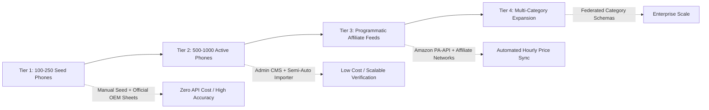

### Dataset Bootstrapping Plan
1. **Tier 1 (Seed 100–250 Devices):** Focus strictly on the top 250 best-selling smartphones launched in India in the last 18 months (Xiaomi, Samsung, Realme, OnePlus, Vivo, Oppo, Apple, Motorola, iQOO, Poco, Nothing).
   * *Data Source:* Official OEM launch spec sheets, press kits, and verified retailer launch listings.
   * *Method:* Seeded via custom JSON fixtures and validated via the Admin CMS.
2. **Tier 2 (500–1,000 Devices):** Semi-automated ingestion where Admin provides an OEM product link; server-side parser extracts raw HTML tables; normalization engine suggests structured mapping; Admin approves in 30 seconds.
3. **Price Seeding:** Daily baseline prices for Top 100 devices maintained via Admin quick-price editor until affiliate API sales thresholds (Amazon 3-sale qualification) are met.

---

## 8. Product Roadmap (Phases 0 to 15)

```
Phase 0: Research, Legal Strategy & Technical Architecture [Weeks 1-2]
Phase 1: Foundation Setup (Monorepo, Express API, Vite React, Design System) [Weeks 3-4]
Phase 2: Database Layer & Canonical Data Modeling (Mongoose, Indexes) [Weeks 5-6]
Phase 3: Admin CMS & Data Ingestion Workflows [Weeks 7-8]
Phase 4: Core Product Pages (PDP, Gallery, Responsive Spec Table) [Weeks 9-10]
Phase 5: Search & Faceted Filtering Engine (Meilisearch + Atlas Aggregations) [Weeks 11-12]
Phase 6: Phone Comparison Engine & Radar Differential Charts [Weeks 13-14]
Phase 7: Price Engine, History & Offer Aggregation [Weeks 15-16]
Phase 8: User Authentication, Wishlists & Price Drop Alerts [Weeks 17-18]
Phase 9: Phone Finder Recommendation Engine & Scoring Algorithm [Weeks 19-20]
Phase 10: User Reviews, Ratings & Anti-Spam Moderation [Weeks 21-22]
Phase 11: SEO Architecture, Dynamic OpenGraph & JSON-LD Automation [Weeks 23-24]
Phase 12: Data Automation, Worker Queues & Affiliate Feeds [Weeks 25-26]
Phase 13: Editorial CMS, Buying Guides & Deals Center [Weeks 27-28]
Phase 14: Performance Optimization, Core Web Vitals & Security Audit [Weeks 29-30]
Phase 15: Public Launch & Category Expansion Framework [Weeks 31+]
```

---

## 9. System Architecture & Component Topology

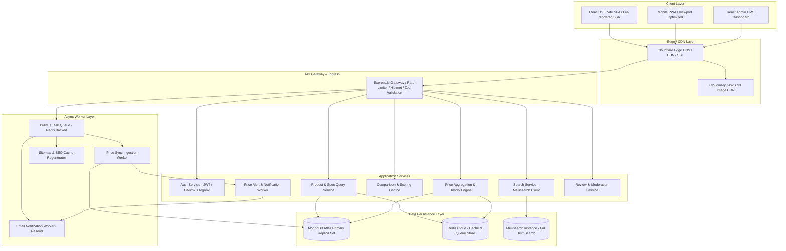

---

## 10. Technology Stack Evaluation & Selection

| Layer | Primary Selection | Evaluated Alternatives | Technical Rationale |
| :--- | :--- | :--- | :--- |
| **Frontend Framework** | **React 19 + Vite + TypeScript** | Next.js (App Router), Vue 3 | Client-heavy interactive filters, comparison tables, and visual wizards require rock-solid client state; Vite provides instant HMR and minimal bundle footprint. SSR/Pre-rendering handled via Vite SSG for SEO landing routes. |
| **Styling & Design System** | **Tailwind CSS v3/v4 + Headless UI + Lucide Icons** | Vanilla CSS, Styled-Components, MUI | Zero runtime CSS overhead, standardized responsive design tokens, rapid layout iteration without CSS bloat. |
| **Client State Management** | **TanStack Query (React Query v5) + Zustand** | Redux Toolkit, Context API | TanStack Query eliminates 95% of boilerplate by managing server cache, polling, and deduplication; Zustand provides tiny (< 2KB), boilerplate-free client state for compare drawers and filters. |
| **Backend Runtime** | **Node.js LTS (v22) + Express.js + TypeScript** | NestJS, Fastify, Go | Mature ecosystem, seamless Mongoose integration, high throughput for I/O-bound query workloads. |
| **Primary Database** | **MongoDB Atlas (Replica Set)** | PostgreSQL, MySQL | Electronics specifications are inherently semi-structured (smartphones have 150+ distinct attributes; laptops have different spec keys). MongoDB document model provides clean polymorphism while Mongoose enforces schema validation. |
| **In-Memory Cache & Queues** | **Redis (Upstash / Redis Cloud) + BullMQ** | RabbitMQ, Kafka, AWS SQS | Ultra-low latency caching for hot PDPs, rate limiting, and robust job queue orchestration with automatic retries, backoff, and concurrency control. |
| **Full-Text Search Engine** | **Meilisearch (with fallback to MongoDB Atlas Search)** | Elasticsearch, Algolia | Meilisearch delivers sub-20ms typo-tolerant typo search with faceted filtering out-of-the-box on a lightweight single-node footprint, avoiding Algolia's prohibitive query pricing. |
| **Validation & Schema Security** | **Zod** | Joi, Yup | First-class TypeScript type inference from runtime schemas across both frontend and backend. |
| **Media Delivery** | **Cloudinary / AWS S3 + Imgix** | Local Disk Storage | WebP/AVIF automated conversion, responsive dynamic resizing, global CDN edge delivery. |

---

## 11. Database Architecture & Complete Mongoose Schemas

The database design uses a hybrid document model: **Strict Reference for Core Entities** (Brand, Product, Variant, Seller, Offer) and **Embedded Subdocuments for Highly Cohesive Specifications** to optimize query performance and eliminate excessive `$lookup` overhead.

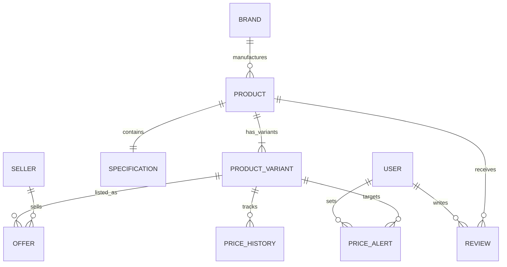

### Core Mongoose Schemas (Production TypeScript Definitions)

```typescript
// ==========================================
// 1. BRAND SCHEMA (brands)
// ==========================================
import mongoose, { Schema, Document } from 'mongoose';

export interface IBrand extends Document {
  name: string;
  slug: string;
  logoUrl: string;
  website: string;
  originCountry: string;
  isActive: boolean;
  productCount: number;
  createdAt: Date;
  updatedAt: Date;
}

export const BrandSchema = new Schema<IBrand>({
  name: { type: String, required: true, trim: true, unique: true },
  slug: { type: String, required: true, unique: true, lowercase: true, index: true },
  logoUrl: { type: String, required: true },
  website: { type: String, trim: true },
  originCountry: { type: String, default: 'Global' },
  isActive: { type: Boolean, default: true, index: true },
  productCount: { type: Number, default: 0 }
}, { timestamps: true });


// ==========================================
// 2. CANONICAL PRODUCT SCHEMA (products)
// ==========================================
export interface IProduct extends Document {
  title: string;                 // e.g. "Samsung Galaxy S24 Ultra"
  slug: string;                  // e.g. "samsung-galaxy-s24-ultra"
  brand: mongoose.Types.ObjectId;
  category: string;              // 'smartphones', 'laptops', etc.
  modelNumber?: string;
  releaseDate: Date;
  status: 'announced' | 'available' | 'rumored' | 'discontinued';
  featuredImage: string;
  galleryImages: string[];
  
  // Highlight Badges & Summary
  summary: string;
  pros: string[];
  cons: string[];
  
  // Calculated Scores (0 - 100)
  scores: {
    overall: number;
    performance: number;
    display: number;
    camera: number;
    battery: number;
    software: number;
    build: number;
    value: number;
  };

  // Base Pricing Cache (Denormalized for fast filter queries)
  priceSummary: {
    minPrice: number;
    maxPrice: number;
    defaultVariant: mongoose.Types.ObjectId;
    hasDeals: boolean;
  };

  viewCount: number;
  isFeatured: boolean;
  isActive: boolean;
  createdAt: Date;
  updatedAt: Date;
}

export const ProductSchema = new Schema<IProduct>({
  title: { type: String, required: true, trim: true, index: 'text' },
  slug: { type: String, required: true, unique: true, lowercase: true, index: true },
  brand: { type: Schema.Types.ObjectId, ref: 'Brand', required: true, index: true },
  category: { type: String, required: true, default: 'smartphones', index: true },
  modelNumber: { type: String, trim: true },
  releaseDate: { type: Date, required: true, index: true },
  status: { 
    type: String, 
    enum: ['announced', 'available', 'rumored', 'discontinued'], 
    default: 'available',
    index: true 
  },
  featuredImage: { type: String, required: true },
  galleryImages: [{ type: String }],
  summary: { type: String, required: true },
  pros: [{ type: String }],
  cons: [{ type: String }],
  scores: {
    overall: { type: Number, min: 0, max: 100, default: 0, index: true },
    performance: { type: Number, min: 0, max: 100, default: 0 },
    display: { type: Number, min: 0, max: 100, default: 0 },
    camera: { type: Number, min: 0, max: 100, default: 0 },
    battery: { type: Number, min: 0, max: 100, default: 0 },
    software: { type: Number, min: 0, max: 100, default: 0 },
    build: { type: Number, min: 0, max: 100, default: 0 },
    value: { type: Number, min: 0, max: 100, default: 0 }
  },
  priceSummary: {
    minPrice: { type: Number, index: true },
    maxPrice: { type: Number },
    defaultVariant: { type: Schema.Types.ObjectId, ref: 'ProductVariant' },
    hasDeals: { type: Boolean, default: false }
  },
  viewCount: { type: Number, default: 0, index: -1 },
  isFeatured: { type: Boolean, default: false, index: true },
  isActive: { type: Boolean, default: true, index: true }
}, { timestamps: true });

// Compound indexes for high-frequency filtering
ProductSchema.index({ category: 1, 'priceSummary.minPrice': 1, 'scores.overall': -1 });
ProductSchema.index({ brand: 1, releaseDate: -1 });


// ==========================================
// 3. PRODUCT VARIANT SCHEMA (product_variants)
// ==========================================
export interface IProductVariant extends Document {
  product: mongoose.Types.ObjectId;
  name: string;                  // e.g. "12GB RAM + 256GB Storage"
  slug: string;                  // e.g. "samsung-galaxy-s24-ultra-12gb-256gb"
  ramGb: number;                 // Normalized: 12
  storageGb: number;             // Normalized: 256
  colorName: string;             // e.g. "Titanium Gray"
  colorHex?: string;             // e.g. "#4A4D4F"
  sku?: string;
  eanGtin?: string;
  isDefault: boolean;
  isActive: boolean;
}

export const ProductVariantSchema = new Schema<IProductVariant>({
  product: { type: Schema.Types.ObjectId, ref: 'Product', required: true, index: true },
  name: { type: String, required: true },
  slug: { type: String, required: true, unique: true, lowercase: true, index: true },
  ramGb: { type: Number, required: true, index: true },
  storageGb: { type: Number, required: true, index: true },
  colorName: { type: String, required: true },
  colorHex: { type: String },
  sku: { type: String, trim: true },
  eanGtin: { type: String, trim: true },
  isDefault: { type: Boolean, default: false },
  isActive: { type: Boolean, default: true }
}, { timestamps: true });

ProductVariantSchema.index({ product: 1, ramGb: 1, storageGb: 1, colorName: 1 }, { unique: true });


// ==========================================
// 4. DETAILED SPECIFICATION SCHEMA (specifications)
// ==========================================
export interface ISpecification extends Document {
  product: mongoose.Types.ObjectId;

  // DISPLAY
  display: {
    screenSizeInches: number;    // e.g. 6.8
    resolution: string;          // e.g. "3120 x 1440 pixels (QHD+)"
    resolutionWidth: number;     // 1440
    resolutionHeight: number;    // 3120
    panelType: string;           // "Dynamic LTPO AMOLED 2X"
    refreshRateHz: number;       // 120
    touchSamplingRateHz?: number;// 240
    peakBrightnessNits: number;  // 2600
    aspectRatio: string;         // "19.5:9"
    pixelDensityPpi: number;     // 505
    screenProtection: string;    // "Corning Gorilla Armor"
    hdrSupport: string[];        // ["HDR10+", "Dolby Vision"]
    notchPunchHole: string;      // "Center Punch-hole"
  };

  // PROCESSOR & HARDWARE
  hardware: {
    chipset: string;             // "Qualcomm Snapdragon 8 Gen 3"
    cpuCores: number;            // 8
    cpuDetails: string;          // "1x3.39 GHz Cortex-X4 & 3x3.1 GHz Cortex-A720 & 2x2.9 GHz Cortex-A720 & 2x2.2 GHz Cortex-A520"
    processNodeNm: number;       // 4
    gpu: string;                 // "Adreno 750"
    antutuScore?: number;        // 2100000
    geekbenchSingle?: number;    // 2250
    geekbenchMulti?: number;     // 6900
    ramType: string;             // "LPDDR5X"
    storageType: string;         // "UFS 4.0"
    expandableStorage: boolean;  // false
  };

  // REAR CAMERA
  rearCamera: {
    setup: string;               // "Quad"
    primaryMp: number;           // 200
    primaryAperture: string;     // "f/1.7"
    primarySensor: string;       // "ISOCELL HP2 (1/1.3\")"
    ois: boolean;                // true
    secondaryCameras: Array<{
      type: string;              // "Telephoto", "Periscope Telephoto", "Ultra-Wide"
      mp: number;                // 50
      aperture: string;          // "f/3.4"
      zoomOptical: number;       // 5
      sensor?: string;
    }>;
    flash: string;               // "LED Flash"
    videoRecording: string[];    // ["8K@30fps", "4K@60/120fps", "1080p@240fps"]
    features: string[];          // ["Laser AF", "Super Steady video", "Nightography"]
  };

  // FRONT CAMERA
  frontCamera: {
    mp: number;                  // 12
    aperture: string;            // "f/2.2"
    videoRecording: string[];    // ["4K@60fps", "1080p@30fps"]
  };

  // BATTERY & CHARGING
  battery: {
    capacityMah: number;         // 5000
    type: string;                // "Li-Ion"
    removable: boolean;          // false
    fastChargingWatts: number;   // 45
    wirelessCharging: boolean;   // true
    wirelessWatts?: number;      // 15
    reverseCharging: boolean;    // true
    chargerInBox: boolean;       // false
  };

  // CONNECTIVITY & PORTS
  connectivity: {
    has5G: boolean;              // true
    bands5G: string[];           // ["n1", "n3", "n5", "n8", "n28", "n77", "n78"]
    bandsCount5G: number;        // 7
    volte: boolean;              // true
    simConfiguration: string;    // "Dual SIM (Nano-SIM and eSIM)"
    wifi: string;                // "Wi-Fi 7 (802.11be)"
    bluetooth: string;           // "Bluetooth 5.3"
    nfc: boolean;                // true
    irBlaster: boolean;          // false
    usbType: string;             // "USB Type-C 3.2 Gen 2"
    headphoneJack35mm: boolean;  // false
  };

  // DESIGN & BUILD
  design: {
    heightMm: number;            // 162.3
    widthMm: number;             // 79.0
    thicknessMm: number;         // 8.6
    weightGrams: number;         // 232
    waterResistanceRating: string; // "IP68"
    backMaterial: string;        // "Corning Gorilla Glass"
    frameMaterial: string;       // "Titanium Grade 2"
  };

  // SOFTWARE & SENSORS
  software: {
    operatingSystem: string;     // "Android"
    osVersion: string;           // "Android 14"
    customUi: string;            // "One UI 6.1"
    promisedOsUpdatesYears: number; // 7
    promisedSecurityUpdatesYears: number; // 7
  };

  sensors: string[];             // ["Ultrasonic Fingerprint", "Accelerometer", "Gyro", "Barometer"]
}

export const SpecificationSchema = new Schema<ISpecification>({
  product: { type: Schema.Types.ObjectId, ref: 'Product', required: true, unique: true, index: true },
  display: {
    screenSizeInches: { type: Number, required: true, index: true },
    resolution: { type: String, required: true },
    resolutionWidth: { type: Number },
    resolutionHeight: { type: Number },
    panelType: { type: String, required: true, index: true },
    refreshRateHz: { type: Number, required: true, index: true },
    touchSamplingRateHz: { type: Number },
    peakBrightnessNits: { type: Number },
    aspectRatio: { type: String },
    pixelDensityPpi: { type: Number },
    screenProtection: { type: String },
    hdrSupport: [{ type: String }],
    notchPunchHole: { type: String }
  },
  hardware: {
    chipset: { type: String, required: true, index: true },
    cpuCores: { type: Number, required: true },
    cpuDetails: { type: String },
    processNodeNm: { type: Number },
    gpu: { type: String },
    antutuScore: { type: Number, index: true },
    geekbenchSingle: { type: Number },
    geekbenchMulti: { type: Number },
    ramType: { type: String },
    storageType: { type: String },
    expandableStorage: { type: Boolean, default: false }
  },
  rearCamera: {
    setup: { type: String, required: true },
    primaryMp: { type: Number, required: true, index: true },
    primaryAperture: { type: String },
    primarySensor: { type: String },
    ois: { type: Boolean, default: false, index: true },
    secondaryCameras: [{
      type: { type: String },
      mp: { type: Number },
      aperture: { type: String },
      zoomOptical: { type: Number },
      sensor: { type: String }
    }],
    flash: { type: String },
    videoRecording: [{ type: String }],
    features: [{ type: String }]
  },
  frontCamera: {
    mp: { type: Number, required: true },
    aperture: { type: String },
    videoRecording: [{ type: String }]
  },
  battery: {
    capacityMah: { type: Number, required: true, index: true },
    type: { type: String, default: 'Li-Ion' },
    removable: { type: Boolean, default: false },
    fastChargingWatts: { type: Number, index: true },
    wirelessCharging: { type: Boolean, default: false, index: true },
    wirelessWatts: { type: Number },
    reverseCharging: { type: Boolean, default: false },
    chargerInBox: { type: Boolean, default: true }
  },
  connectivity: {
    has5G: { type: Boolean, required: true, index: true },
    bands5G: [{ type: String }],
    bandsCount5G: { type: Number, default: 0 },
    volte: { type: Boolean, default: true },
    simConfiguration: { type: String },
    wifi: { type: String },
    bluetooth: { type: String },
    nfc: { type: Boolean, default: false, index: true },
    irBlaster: { type: Boolean, default: false },
    usbType: { type: String },
    headphoneJack35mm: { type: Boolean, default: false }
  },
  design: {
    heightMm: { type: Number },
    widthMm: { type: Number },
    thicknessMm: { type: Number },
    weightGrams: { type: Number, index: true },
    waterResistanceRating: { type: String, index: true },
    backMaterial: { type: String },
    frameMaterial: { type: String }
  },
  software: {
    operatingSystem: { type: String, required: true },
    osVersion: { type: String, required: true },
    customUi: { type: String },
    promisedOsUpdatesYears: { type: Number },
    promisedSecurityUpdatesYears: { type: Number }
  },
  sensors: [{ type: String }]
}, { timestamps: true });


// ==========================================
// 5. SELLER & OFFER SCHEMAS (sellers & offers)
// ==========================================
export interface ISeller extends Document {
  name: string;                  // "Amazon India", "Flipkart", "Croma"
  slug: string;                  // "amazon-in", "flipkart"
  domain: string;                // "amazon.in"
  logoUrl: string;
  affiliateTagParam: string;     // e.g. "tag=phonoworld-21"
  isActive: boolean;
}

export const SellerSchema = new Schema<ISeller>({
  name: { type: String, required: true, unique: true },
  slug: { type: String, required: true, unique: true, lowercase: true },
  domain: { type: String, required: true },
  logoUrl: { type: String, required: true },
  affiliateTagParam: { type: String },
  isActive: { type: Boolean, default: true }
}, { timestamps: true });

export interface IOffer extends Document {
  variant: mongoose.Types.ObjectId;
  seller: mongoose.Types.ObjectId;
  productUrl: string;
  affiliateUrl: string;
  mrp: number;                   // Maximum Retail Price: 134999
  price: number;                 // Current Listed Price: 129999
  effectivePrice?: number;       // Price after guaranteed bank discount: 124999
  discountPercent: number;
  inStock: boolean;
  couponText?: string;
  bankOfferSummary?: string;     // "₹5,000 instant discount on HDFC Cards"
  lastCheckedAt: Date;
  isLowestEver: boolean;
}

export const OfferSchema = new Schema<IOffer>({
  variant: { type: Schema.Types.ObjectId, ref: 'ProductVariant', required: true, index: true },
  seller: { type: Schema.Types.ObjectId, ref: 'Seller', required: true, index: true },
  productUrl: { type: String, required: true },
  affiliateUrl: { type: String, required: true },
  mrp: { type: Number, required: true },
  price: { type: Number, required: true, index: true },
  effectivePrice: { type: Number },
  discountPercent: { type: Number, default: 0 },
  inStock: { type: Boolean, default: true, index: true },
  couponText: { type: String },
  bankOfferSummary: { type: String },
  lastCheckedAt: { type: Date, default: Date.now, index: true },
  isLowestEver: { type: Boolean, default: false }
}, { timestamps: true });

OfferSchema.index({ variant: 1, price: 1 });


// ==========================================
// 6. TIME-SERIES PRICE HISTORY (price_histories)
// ==========================================
export interface IPriceHistory extends Document {
  variant: mongoose.Types.ObjectId;
  seller: mongoose.Types.ObjectId;
  price: number;
  recordedAt: Date;
}

export const PriceHistorySchema = new Schema<IPriceHistory>({
  variant: { type: Schema.Types.ObjectId, ref: 'ProductVariant', required: true, index: true },
  seller: { type: Schema.Types.ObjectId, ref: 'Seller', required: true },
  price: { type: Number, required: true },
  recordedAt: { type: Date, default: Date.now, index: true }
}, { timestamps: false });

PriceHistorySchema.index({ variant: 1, recordedAt: -1 });


// ==========================================
// 7. USER & PRICE ALERTS (users & price_alerts)
// ==========================================
export interface IUser extends Document {
  email: string;
  passwordHash?: string;
  name: string;
  avatarUrl?: string;
  role: 'user' | 'moderator' | 'admin';
  provider: 'local' | 'google';
  isEmailVerified: boolean;
  wishlist: mongoose.Types.ObjectId[];
}

export const UserSchema = new Schema<IUser>({
  email: { type: String, required: true, unique: true, lowercase: true, trim: true },
  passwordHash: { type: String },
  name: { type: String, required: true, trim: true },
  avatarUrl: { type: String },
  role: { type: String, enum: ['user', 'moderator', 'admin'], default: 'user', index: true },
  provider: { type: String, enum: ['local', 'google'], default: 'local' },
  isEmailVerified: { type: Boolean, default: false },
  wishlist: [{ type: Schema.Types.ObjectId, ref: 'Product' }]
}, { timestamps: true });

export interface IPriceAlert extends Document {
  user: mongoose.Types.ObjectId;
  variant: mongoose.Types.ObjectId;
  targetPrice: number;
  startingPrice: number;
  email: string;
  status: 'active' | 'triggered' | 'cancelled';
  triggeredAt?: Date;
}

export const PriceAlertSchema = new Schema<IPriceAlert>({
  user: { type: Schema.Types.ObjectId, ref: 'User', required: true, index: true },
  variant: { type: Schema.Types.ObjectId, ref: 'ProductVariant', required: true, index: true },
  targetPrice: { type: Number, required: true },
  startingPrice: { type: Number, required: true },
  email: { type: String, required: true },
  status: { type: String, enum: ['active', 'triggered', 'cancelled'], default: 'active', index: true },
  triggeredAt: { type: Date }
}, { timestamps: true });
```

---

## 12. Canonical Product Identity, SKU Matching & Deduplication

### The Identity Challenge
Retailers list identical phones under divergent titles:
* *Amazon:* `"Samsung Galaxy S24 Ultra 5G (Titanium Gray, 12GB RAM, 256GB Storage)"`
* *Flipkart:* `"SAMSUNG Galaxy S24 Ultra 5G (Titanium Grey, 256 GB) (12 GB RAM)"`
* *Croma:* `"Samsung Galaxy S24 Ultra 5G 12GB RAM 256GB ROM Titanium Gray (Model: SM-S928B)"`

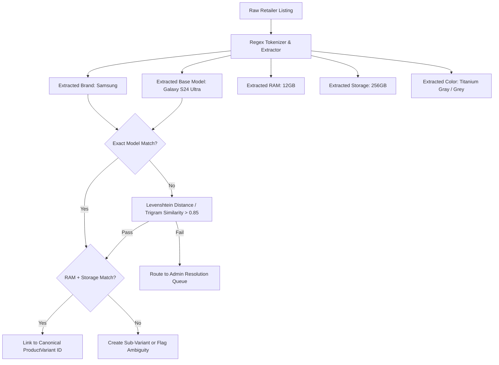

### Deterministic Matching Algorithm
1. **Model Normalization:** Strip marketing fluff (`5G`, `AI`, `Special Edition`, `With Offer`). Normalize brand aliases (`OnePlus`, `1+`, `One Plus` $\rightarrow$ `OnePlus`).
2. **Hardware Fingerprinting:** Extract standardized tuples: `[Brand, CanonicalModel, RAM_GB, Storage_GB]`.
3. **Color Canonicalization:** Map localized retailer colors to standard palette keys:
   * `"Titanium Grey"`, `"Titanium Gray"` $\rightarrow$ `Titanium Gray`
   * `"Midnight Black"`, `"Phantom Black"`, `"Obsidian"` $\rightarrow$ `Black`
4. **Confidence Scoring:**
   * $\ge 0.95$: Automatic offer attachment.
   * $0.75 - 0.94$: Provisional attachment flagged for 1-click admin confirmation.
   * $< 0.75$: Discarded or held in ingestion quarantine.

---

## 13. Data Sources & Programmatic Feeds

| Source | Access Route | Requirements | Rate Limits | Data Points Obtained | Legal / Storage Constraints |
| :--- | :--- | :--- | :--- | :--- | :--- |
| **Amazon India** | Amazon Creators API / PA-API v5 | Active Associates account; min 3 qualifying sales / 30 days. | 1 req/sec base; scales with affiliate revenue. | Real-time price, availability, affiliate URL, product title, high-res images. | Price caching limited to 24h unless displayed with timestamp; must show official Amazon attribution. |
| **Flipkart** | Flipkart Affiliate API / Infix Network feeds | Registered affiliate or partnership via Cuelinks / EarnKaro. | Batched daily product feeds / 10 req/min API. | Price, MRP, stock status, direct tracking URL, offers. | Terms prohibit automated page scraping; feeds must be used for affiliate redirection. |
| **Croma / Reliance / Vijay Sales** | Cuelinks / Admitad Affiliate API feeds | Cuelinks Publisher Account. | Synchronized daily CSV/JSON data drops. | Product feed pricing, deep-links, campaign commission rates. | Standard affiliate terms; no direct site scraping. |
| **OEM Official Portals** (Samsung, Apple, Xiaomi) | Manual Ingestion + Admin assisted JSON parser | None (Public press releases & spec sheets). | N/A (One-time ingestion per device launch). | 100% verified hardware specs, sensor models, 5G bands, official dimensions. | Factual hardware specs are not copyrightable; images used under fair-use commentary or official press kits. |

---

## 14. Data Licensing & Compliance Strategy

1. **Facts vs. Expression:** Under Indian Copyright Law (Copyright Act 1957) and international doctrine, pure factual technical specifications (e.g., *battery capacity: 5000 mAh*, *screen size: 6.7 inches*) are non-copyrightable facts. PhonoWorld generates its own original summaries, pros/cons, review syntheses, and calculated scores.
2. **Product Imagery:** All product images are sourced from official manufacturer press media kits or converted into optimized multi-angle renders. High-resolution retailer thumbnails are linked with proper affiliate attribution.
3. **Indian DPDP Act 2023 Compliance:**
   * Minimalist user data collection (Email, hashed password, wishlists).
   * Explicit consent for price drop email notifications.
   * 1-click Account Deletion and data export via User Profile settings.
4. **Affiliate Transparency Disclosure:** Clear, prominent disclaimer placed on all PDPs and comparison tables:
   > *"PhonoWorld is reader-supported. When you purchase through links on our site, we may earn an affiliate commission at no additional cost to you. Prices and availability are accurate as of the timestamp indicated."*

---

## 15. Data Ingestion Architecture & Pipeline

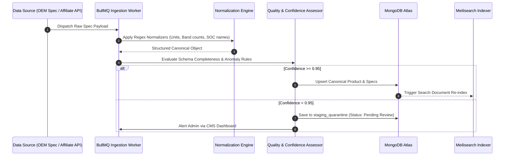

---

## 16. Data Normalization Engine

The normalization engine converts unstructured string inputs from varied sources into clean, queryable, typed numerical and categorical primitives.

### Standard Normalization Rules

```typescript
export class SpecNormalizer {
  // Normalize Battery: "5,000mAh", "5000 mAh (typical)", "5000mA" -> 5000
  static normalizeBattery(raw: string): number {
    const match = raw.replace(/,/g, '').match(/(\d{4,5})\s*mah/i);
    return match ? parseInt(match[1], 10) : 0;
  }

  // Normalize Refresh Rate: "120 Hz Adaptive", "120hz", "Smooth 120Hz" -> 120
  static normalizeRefreshRate(raw: string): number {
    const match = raw.match(/(\d{2,3})\s*hz/i);
    return match ? parseInt(match[1], 10) : 60;
  }

  // Normalize Fast Charging: "SuperVOOC 80W", "45W Fast Charging" -> 80
  static normalizeChargingWatts(raw: string): number {
    const match = raw.match(/(\d{2,3})\s*w/i);
    return match ? parseInt(match[1], 10) : 0;
  }

  // Normalize 5G Bands: "n1/n3/n5/n8/n28A/n77/n78", "Supports 5G: N78, N77" -> ["n1", "n3", "n5", "n8", "n28", "n77", "n78"]
  static normalize5GBands(raw: string | string[]): { bands: string[], count: number } {
    const text = Array.isArray(raw) ? raw.join(' ') : raw;
    const matches = text.toLowerCase().match(/n\d{1,3}/g) || [];
    const uniqueBands = Array.from(new Set(matches.map(b => b.trim())));
    return { bands: uniqueBands, count: uniqueBands.length };
  }

  // Normalize Screen Size: "6.78 inches (17.22 cm)", "6.7\"" -> 6.78
  static normalizeScreenSize(raw: string): number {
    const match = raw.match(/(\d{1,2}\.\d{1,2})\s*(?:inches|inch|\")/i);
    return match ? parseFloat(match[1]) : 0;
  }
}
```

---

## 17. Data Quality, Conflict Resolution & Confidence Scoring

Every specification field is tagged with a provenance metadata score:

$$\text{Confidence Score} = w_s \cdot S_{\text{source}} + w_c \cdot S_{\text{completeness}} - P_{\text{outlier}}$$

Where:
* $S_{\text{source}}$: Manufacturer Official Document = 1.0; Verified Retailer Launch Listing = 0.85; Third-Party Crowdsource = 0.5.
* $w_s = 0.7$, $w_c = 0.3$.
* $P_{\text{outlier}}$: Penalty applied if a spec is $\ge 3\sigma$ outside historical category norms (e.g., a phone claiming 18,000 mAh battery or 500W charging).

### Conflict Resolution Strategy
1. If Source A (Manufacturer) conflicts with Source B (Retailer), **Source A overrides Source B automatically**.
2. If two active retailer feeds show divergent RAM/Storage for the same SKU, both offers are isolated into separate variant records pending admin verification.
3. Changes to published specifications are logged in the `audit_logs` collection with before/after diffs and author ID.

---

## 18. Search Architecture & Query Intent Parsing Engine

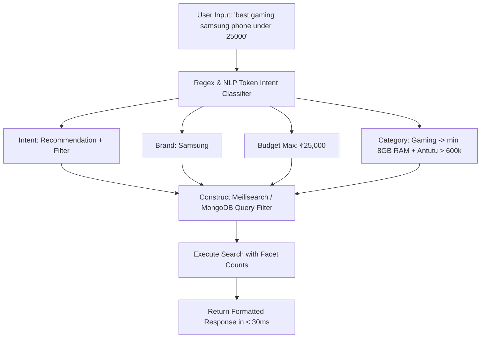

### Typo Tolerance & Synonym Dictionaries
* **Brand Synonyms:** `sammy` $\rightarrow$ `Samsung`, `moto` $\rightarrow$ `Motorola`, `ipone` / `ihpone` $\rightarrow$ `Apple iPhone`, `mi` / `redmi` $\rightarrow$ `Xiaomi`.
* **Feature Synonyms:** `fast charge` $\rightarrow$ `fastChargingWatts >= 45`, `amoled` $\rightarrow$ `panelType: AMOLED`, `clean android` $\rightarrow$ `customUi: ["Stock", "Pixel UI", "Hello UI", "OxygenOS"]`.

---

## 19. Filtering & Faceted Navigation Engine

```typescript
// Example High-Performance MongoDB Facet Aggregation Pipeline
export const buildProductFilterPipeline = (filters: {
  category: string;
  minPrice?: number;
  maxPrice?: number;
  brands?: string[];
  minRam?: number;
  minStorage?: number;
  has5G?: boolean;
  minBattery?: number;
  panelType?: string;
  page?: number;
  limit?: number;
}) => {
  const matchStage: any = { category: filters.category, isActive: true };

  if (filters.minPrice || filters.maxPrice) {
    matchStage['priceSummary.minPrice'] = {};
    if (filters.minPrice) matchStage['priceSummary.minPrice'].$gte = filters.minPrice;
    if (filters.maxPrice) matchStage['priceSummary.minPrice'].$lte = filters.maxPrice;
  }

  if (filters.brands && filters.brands.length > 0) {
    matchStage.brand = { $in: filters.brands.map(b => new mongoose.Types.ObjectId(b)) };
  }

  return [
    { $match: matchStage },
    {
      $facet: {
        products: [
          { $sort: { 'scores.overall': -1, 'priceSummary.minPrice': 1 } },
          { $skip: ((filters.page || 1) - 1) * (filters.limit || 20) },
          { $limit: filters.limit || 20 },
          {
            $lookup: {
              from: 'brands',
              localField: 'brand',
              foreignField: '_id',
              as: 'brandDetails'
            }
          },
          { $unwind: '$brandDetails' }
        ],
        totalCount: [{ $count: 'count' }],
        brandBuckets: [{ $group: { _id: '$brand', count: { $sum: 1 } } }],
        priceRange: [
          {
            $group: {
              _id: null,
              min: { $min: '$priceSummary.minPrice' },
              max: { $max: '$priceSummary.minPrice' }
            }
          }
        ]
      }
    }
  ];
};
```

---

## 20. Phone Comparison Engine & UX

### Comparison Matrix Features
1. **Interactive Difference Highlighting:** A 1-click toggle (`Show Differences Only`) recalculates table cell variance across selected columns and hides rows where all devices share identical values.
2. **Dynamic Radar Chart:** 6-axis visual benchmark (CPU Performance, Camera Versatility, Display Quality, Battery Endurance, Fast Charging, Value for Money).
3. **Spec-Diff Summary Engine:** Generates plain-English takeaway bullets:
   * *"OnePlus 12 charges 82% faster than Galaxy S24 (100W vs 25W)."*
   * *"Galaxy S24 offers 3 additional years of guaranteed OS upgrades (7 vs 4 years)."*
4. **Variant Matcher:** Seamlessly change storage variants inside the comparison table without reloading the view.

---

## 21. Price Engine, Aggregation & Anomaly Detection

### Price Anomaly Guardrail
Before saving any ingested price to the live database, the Price Engine runs sanity tests:
* If $P_{\text{new}} < 0.40 \times P_{\text{last}}$ (price dropped by > 60% in a single tick), the price update is flagged as a **Flash Glitch / Seller Anomaly** and quarantined for 15 minutes before triggering price alerts.
* Prevents notifying 5,000 users of false pricing due to merchant typos (e.g., iPhone 15 listed at ₹6,599 instead of ₹65,999).

---

## 22. Price History Storage, Time-Series Modeling & Terms Compliance

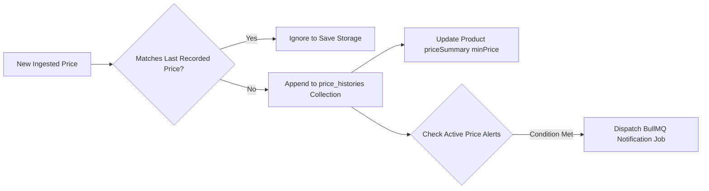

### Storage Optimization
Instead of inserting redundant price ticks every hour, PhonoWorld implements **Change-On-Delta Compression**: an entry is written only when price changes or once every 7 days as a heartbeat confirmation.

---

## 23. Price Alert System & Notification Dispatcher

1. **User Sets Target:** e.g., Alert me when *OnePlus 12R* drops below ₹35,000.
2. **Worker Evaluation:** When a new lowest price is confirmed, a Redis BullMQ job (`process-price-alert`) fetches all active alerts where `targetPrice >= newPrice`.
3. **Rate Limiting & De-duplication:** Max 1 email per user per product per 48 hours to prevent notification fatigue.
4. **Email Delivery:** High-deliverability transactional HTML emails sent via **Resend** containing:
   * Confirmed dropping store (e.g., Amazon India).
   * Exact discount percentage and direct tracking link.
   * 1-click "Unsubscribe from this alert" link.

---

## 24. Recommendation Engine & Transparent Multi-Attribute Scoring

### Algorithm Formulation
Given user priority weights $W = \{w_p, w_c, w_b, w_d, w_s\}$ where $\sum w_i = 1.0$:

$$\text{Match Score}(P) = \sum_{i} \left( w_i \cdot S_i(P) \right) \times \text{Budget Penalty}(P)$$

$$\text{Budget Penalty}(P) = \begin{cases} 
1.0 & \text{if } \text{Price}(P) \le \text{Budget}_{\text{max}} \\
\max\left(0, 1 - \frac{\text{Price}(P) - \text{Budget}_{\text{max}}}{0.15 \times \text{Budget}_{\text{max}}}\right) & \text{if } \text{Price}(P) > \text{Budget}_{\text{max}}
\end{cases}$$

### Explainability Engine
For every recommended phone, the engine constructs 3 standardized rationale components:
1. **Primary Win:** The exact sub-score where the device leads its price cohort (e.g., *Top 5% AnTuTu performance under ₹25k*).
2. **Trade-off Acknowledgment:** The lowest sub-score (e.g., *Mono speaker setup; no 3.5mm jack*).
3. **Ideal Alternative:** Suggests a runner-up if the user values an opposing attribute (e.g., *If you prefer camera over gaming, consider Moto Edge 50 Fusion*).

---

## 25. User Review System & Anti-Spam Moderation

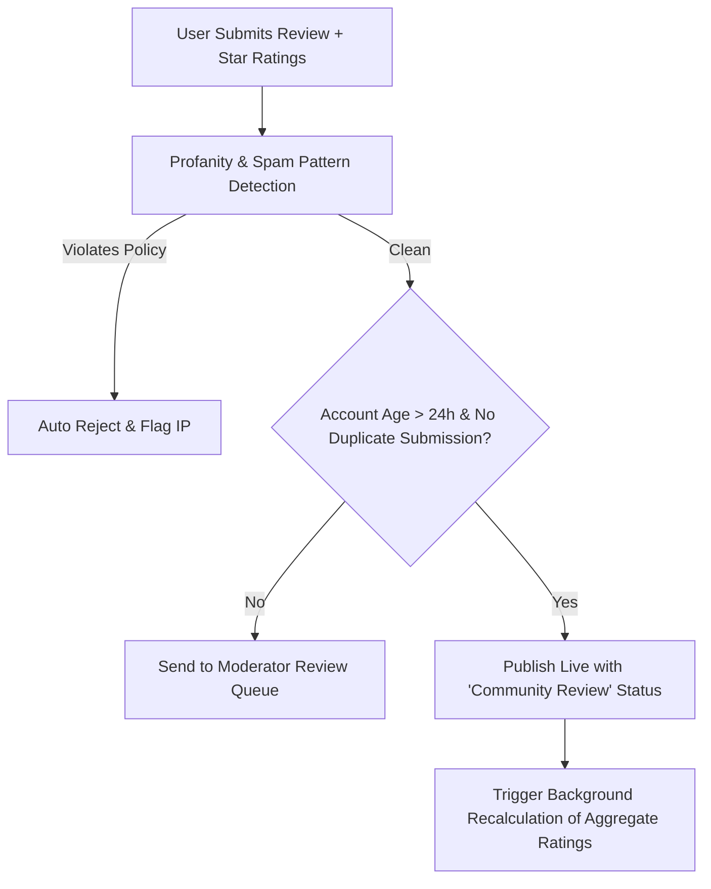

### Review Authenticity Protections
* Rate limit: Max 2 reviews per user per 24 hours.
* Pros/Cons enforcement: Reviewers must provide at least 1 structured pro and 1 con (minimum 10 characters each) to prevent empty 1-star / 5-star spam ratings.
* Helpful / Unhelpful voting buttons with session deduplication.

---

## 26. Proprietary Spec Scoring Methodology

PhonoWorld calculates an open, deterministic 0–100 score for every phone based on 8 sub-indices normalized against current market standards:

$$\text{Overall Score} = 0.22 S_{\text{perf}} + 0.20 S_{\text{cam}} + 0.16 S_{\text{disp}} + 0.16 S_{\text{batt}} + 0.10 S_{\text{soft}} + 0.08 S_{\text{build}} + 0.08 S_{\text{conn}}$$

```
Sub-Index Calculations:
1. Performance (S_perf): Normalized AnTuTu v10 score + LPDDR5X/UFS 4.0 bonuses + CPU node efficiency (4nm = 100, 6nm = 80).
2. Camera (S_cam): Primary sensor size (1/1.3" vs 1/2.0") + Optical Image Stabilization (OIS) presence + Telephoto/Periscope existence + 4K/8K recording capabilities.
3. Display (S_disp): Refresh rate (120Hz = 90, 144Hz+ = 100) + Panel Type (LTPO AMOLED = 100, AMOLED = 85, LCD = 50) + Peak Nits.
4. Battery (S_batt): Capacity mAh + Fast charging wattage (120W = 100, 67W = 85, 25W = 60) + Wireless charging presence.
5. Software (S_soft): Guaranteed update longevity (7 yrs = 100, 4 yrs = 80, 2 yrs = 50) + Bloatware penalty.
6. Build & Design (S_build): IP68 = 100, IP65/64 = 75, IP54 = 50 + Gorilla Glass Victus/Armor vs Plastic.
7. Connectivity (S_conn): Indian 5G band count (>= 10 bands = 100, 6-9 bands = 80, < 5 bands = 50) + Wi-Fi 7/6E + NFC.
8. Value Score: (Overall Score / Current Listed Price) normalized across the price segment.
```

---

## 27. Admin CMS & Editorial Workflows

### Admin Panel Capabilities
* **Product Management:** Full multi-tab editor for Specifications, Variants, Image Galleries, and SEO Metadata.
* **Price Override & Quick Edit:** Inline table editing for rapid price corrections during festival sales (Big Billion Days / Great Indian Festival).
* **Quarantine Queue:** Review parsed specs with color-coded confidence indicators (Green $\ge 95\%$, Amber $75-94\%$, Red $< 75\%$).
* **Review Moderation:** Approve, edit, or reject flagged user reviews with 1 click.
* **Audit Logs:** Full tracking of which admin modified specs, timestamp, and IP address.

---

## 28. Frontend Architecture

```
apps/web/src/
├── app/                  # Application Routes & Page Layouts
│   ├── (public)/         # SEO-public routes (Home, PDP, Compare, Finder, Guides)
│   ├── (auth)/           # Login, Signup, Reset Password
│   └── (user)/           # Profile, Wishlist, Alerts Settings
├── components/           # Modular Reusable UI Components
│   ├── ui/               # Design System Primitives (Button, Modal, Input, Badge)
│   ├── product/          # ProductCard, SpecTable, PriceBox, RadarChart, Gallery
│   ├── compare/          # CompareGrid, DiffHighlighter, StickyHeader
│   ├── finder/           # WizardStep, SliderControl, MatchCard
│   └── layout/           # Navbar, Footer, MobileNav, FilterDrawer
├── hooks/                # Custom React Hooks (useCompare, useFilters, useDebounce)
├── services/             # API Client Layer (TanStack Query query functions)
├── store/                # Zustand Client Stores (compareStore, filterStore)
├── types/                # TypeScript Interface Definitions
└── utils/                # Formatters (INR Currency, Spec Normalizers, Slugs)
```

---

## 29. UX Architecture & Product Detail Page (PDP) Blueprint

```
+-----------------------------------------------------------------------------------+
|  [Navbar]  Logo | Search Phones... (Cmd+K) | Compare (3) | Finder | Deals | Login  |
+-----------------------------------------------------------------------------------+
|  Breadcrumbs: Home > Smartphones > Samsung > Samsung Galaxy S24 Ultra            |
|                                                                                   |
|  +---------------------------+  +-----------------------------------------------+ |
|  |                           |  | Samsung Galaxy S24 Ultra 5G                   | |
|  |   [Image Gallery]         |  | ★★★★☆ 4.6 (1,240 Reviews) | PhonoScore: 92/100 | |
|  |   - Multi-angle carousel  |  | --------------------------------------------- | |
|  |   - 360-degree view       |  | Best Price: ₹1,29,999 (MRP ₹1,34,999) 4% Off  | |
|  |   - Color selector chips  |  | Effective: ₹1,24,999 with HDFC Bank Card Offer  | |
|  |                           |  | [Buy at Amazon] [Buy at Flipkart] [Set Alert] | |
|  +---------------------------+  +-----------------------------------------------+ |
|                                                                                   |
|  [Sticky Sub-Nav]: Overview | Key Specs | Price Comparison | Full Specs | Reviews  |
|  -------------------------------------------------------------------------------  |
|  [Key Specs Grid - 6 Iconic Badges]:                                              |
|  +---------------+ +---------------+ +---------------+ +-----------------------+  |
|  | 6.8" QHD+     | | Snapdragon    | | 200MP Quad    | | 5000 mAh              |  |
|  | 120Hz AMOLED  | | 8 Gen 3 (4nm) | | OIS + 5x Zoom | | 45W Fast Charging     |  |
|  +---------------+ +---------------+ +---------------+ +-----------------------+  |
|                                                                                   |
|  [Radar Performance Chart] vs [Cohort Average in ₹1,00,000+ Flagship Segment]     |
|                                                                                   |
|  [Price Comparison Across Indian Retailers]:                                      |
|  - Amazon India: ₹1,29,999 | In Stock | Free Delivery | [Go to Store]             |
|  - Flipkart:     ₹1,31,999 | In Stock | 5% Axis CB    | [Go to Store]             |
|  - Croma:        ₹1,34,999 | Store Pickup Available   | [Go to Store]             |
|                                                                                   |
|  [Interactive Price History Graph (30d / 90d / 180d / 1yr)]:                     |
|  - Lowest recorded: ₹1,19,999 on 15-Aug-2025 | Current Price Status: FAIR BUY      |
|                                                                                   |
|  [Full Specification Accordion with Search Spec Filter]                           |
|                                                                                   |
|  [User Reviews & Verified Ratings]                                                |
|                                                                                   |
|  [Top 3 Alternatives in Same Budget]:                                             |
|  - iPhone 15 Pro Max | Vivo X100 Pro | Xiaomi 14 Ultra                            |
+-----------------------------------------------------------------------------------+
```

---

## 30. Mobile-First Optimization Strategy & Responsive UX

Over **78% of Indian consumer tech traffic originates on mobile devices**.
1. **Sticky Bottom Purchase & Comparison Bar:** Shows current lowest price, active bank offer summary, and primary "Go to Store" CTA fixed at the viewport bottom.
2. **Bottom-Sheet Filter Drawer:** Ergonomic thumb-zone filters with instant result counts (e.g., *"Show 42 Phones"*).
3. **Horizontal Swipe Compare Columns:** Fluid touch-scrolling side-by-side spec comparisons with fixed left attribute titles.
4. **Touch-Target Compliance:** Minimum 48x48px hit areas for all interactive buttons and filter chips.

---

## 31. Performance Engineering & Core Web Vitals Optimization

| Core Web Vital Metric | Target | Optimization Technique |
| :--- | :--- | :--- |
| **LCP (Largest Contentful Paint)** | **< 1.5s** | High-priority preloading of primary WebP hero images; edge CDN caching via Cloudflare; server-side critical CSS inlining. |
| **FID / INP (Interaction to Next Paint)** | **< 80ms** | Debounced filter state updates (150ms); virtualization of 500+ item spec lists via `react-window`; lean client bundle (< 120KB initial JS). |
| **CLS (Cumulative Layout Shift)** | **< 0.02** | Explicit image aspect-ratio containers (`aspect-[4/3]`); zero dynamic ad-slot resizing; skeleton placeholders for price boxes. |
| **TTFB (Time to First Byte)** | **< 120ms** | Edge HTML caching for public landing routes with stale-while-revalidate invalidation headers. |

---

## 32. Security Architecture & Threat Mitigation

```
[Security Mitigation Matrix]:
├── Transport Layer: Enforced HTTPS, TLS 1.3, HSTS (max-age=31536000), DNSSEC.
├── HTTP Security Headers: Helmet (Content-Security-Policy, X-Frame-Options: DENY, X-Content-Type-Options: nosniff).
├── Authentication: HttpOnly, Secure, SameSite=Strict JWT refresh tokens stored in cookies; Argon2id password hashing.
├── API Defense: Express Rate Limiter (100 req/min for public search; 5 req/min for auth routes; 2 req/min for reviews).
├── Injection Prevention: Strict Zod request payload schema validation; Mongoose query sanitization against NoSQL injection ($gt/$ne stripping).
└── Cross-Site Scripting (XSS): DOMPurify sanitization on all user-submitted review text before database insertion and render.
```

---

## 33. Background Jobs & Asynchronous Worker Architecture

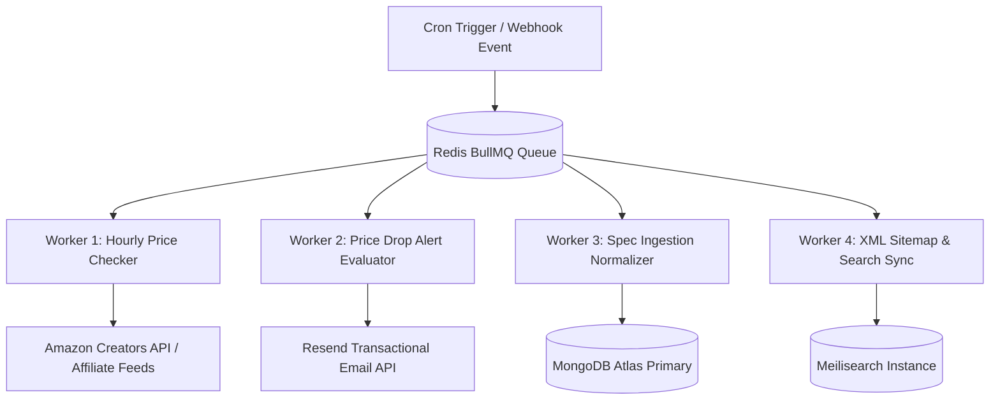

---

## 34. API Architecture & REST API Specification

### Endpoint Inventory

```
AUTHENTICATION & USERS:
  POST   /api/v1/auth/register            -> Register local user
  POST   /api/v1/auth/login               -> Authenticate user & issue JWT
  POST   /api/v1/auth/google              -> Authenticate via Google OAuth
  POST   /api/v1/auth/refresh             -> Refresh access token
  GET    /api/v1/users/me                 -> Get current user profile & wishlist
  PATCH  /api/v1/users/me/wishlist        -> Add / remove product from wishlist

PRODUCTS & CATALOG:
  GET    /api/v1/products                 -> List & filter products (faceted pagination)
  GET    /api/v1/products/:slug           -> Get full PDP (Product + Variant + Specs + Offers)
  GET    /api/v1/products/:slug/history   -> Get historical price time-series
  GET    /api/v1/brands                   -> List active brands

SEARCH & RECOMMENDATIONS:
  GET    /api/v1/search                   -> Full-text search with instant autocomplete
  POST   /api/v1/recommendations/wizard   -> Execute Phone Finder weighted scoring

COMPARISON:
  GET    /api/v1/compare                  -> Fetch side-by-side comparison payload (?slugs=a,b,c)

PRICE ALERTS:
  POST   /api/v1/alerts                   -> Create new price drop alert
  DELETE /api/v1/alerts/:id               -> Cancel price alert

REVIEWS:
  GET    /api/v1/products/:id/reviews     -> List paginated reviews with aggregate stats
  POST   /api/v1/products/:id/reviews     -> Submit new user review (Auth required)

ADMIN CMS (Admin Role Required):
  POST   /api/v1/admin/products           -> Create canonical product + specs
  PUT    /api/v1/admin/products/:id       -> Update product specs & badges
  PATCH  /api/v1/admin/offers/:id/price   -> Quick override price
  GET    /api/v1/admin/quarantine         -> List unverified parsed specs
  POST   /api/v1/admin/quarantine/:id/act -> Approve / Reject staged import
```

---

## 35. Analytics & Event Tracking Framework

### Core Event Taxonomy
* `product_viewed` (`productId`, `slug`, `brand`, `price`, `sourceCategory`)
* `search_performed` (`query`, `resultsCount`, `executionTimeMs`, `filtersApplied`)
* `comparison_created` (`productIds: string[]`, `category`, `source`)
* `outbound_affiliate_clicked` (`productId`, `variantId`, `sellerId`, `price`, `positionOnPage`)
* `price_alert_created` (`variantId`, `targetPrice`, `currentPrice`)
* `finder_wizard_completed` (`budgetMin`, `budgetMax`, `topMatchProductId`, `priorities`)

---

## 36. Observability, Logging, Metrics & Alerting Strategy

1. **Structured JSON Logging:** Winston logger outputting standard structured logs (`level`, `timestamp`, `correlationId`, `route`, `statusCode`, `latencyMs`).
2. **Error Tracking:** Sentry SDK integrated on both React client and Express backend for real-time unhandled exception capture.
3. **Health Check Probes:** `/api/health` checking MongoDB connection state, Redis ping, and Meilisearch sync status.
4. **Alert Thresholds:** Discord / Telegram webhook notifications triggered if 5xx error rate exceeds 1% over 5 minutes or if Price Ingestion Worker fails 3 consecutive cycles.

---

## 37. Comprehensive Testing Strategy

```
[PhonoWorld Quality Assurance Pyramid]:
├── E2E Tests (Playwright): Critical user journeys (Search -> Filter -> View PDP -> Compare -> Click Affiliate Link).
├── Integration Tests (Supertest + Jest): REST API endpoints, Auth JWT validation, Facet aggregation pipelines.
├── Unit Tests (Vitest): Spec normalizers, Spec scoring algorithms, Price anomaly mathematical calculations.
└── Data Schema Tests: Zod and Mongoose schema validation tests ensuring zero corrupted specs enter database.
```

---

## 38. DevOps & CI/CD Pipeline

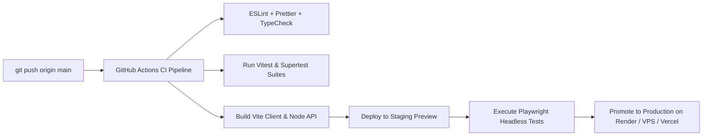

---

## 39. Deployment Architecture (Bootstrapped Budget)

```
[Bootstrapped Production Topology ($15 - $35 / month)]:
├── Frontend Client: Vercel / Cloudflare Pages (Free Tier - Global Edge CDN, Instant SSL).
├── Backend API Server: Render / Railway Web Service or single Hetzner VPS (Node.js 22 LTS).
├── Database: MongoDB Atlas Shared Tier (M0 Free -> M10 Dedicated at scale).
├── Caching & Queues: Redis Cloud / Upstash (Free tier -> 256MB Dedicated).
├── Search Engine: Meilisearch running on Docker (Shared VPS / Fly.io).
└── Email Delivery: Resend (Free 3,000 emails/month).
```

---

## 40. Cost Model Across User Scales

| Component | MVP Stage ($ / mo) | 10k MAU ($ / mo) | 100k MAU ($ / mo) | 1M MAU ($ / mo) |
| :--- | :--- | :--- | :--- | :--- |
| **Frontend Hosting** | $0 (Vercel / CF) | $0 (Vercel) | $20 (Vercel Pro) | $100 (Edge Bandwidth) |
| **Backend API** | $7 (Render Starter) | $15 (Railway / Render) | $50 (2x VPS / Cluster) | $250 (Auto-scaling cluster) |
| **MongoDB Database** | $0 (Atlas M0) | $10 (Atlas M2/M5) | $57 (Atlas M10 Dedicated)| $220 (Atlas M30 Dedicated) |
| **Redis & Queue** | $0 (Upstash Free) | $5 (Upstash / Redis) | $20 (Redis Cloud) | $60 (High Availability Redis) |
| **Search Engine** | $0 (Embedded Meili) | $5 (Fly.io / VPS) | $25 (Dedicated Meili) | $120 (Clustered Search) |
| **Media / CDN** | $0 (Cloudinary Free) | $0 (Cloudinary) | $20 (AWS S3 + Cloudflare)| $80 (Global Edge Traffic) |
| **Transactional Email**| $0 (Resend Free) | $0 (Resend) | $20 (Resend Growth) | $80 (High-volume alerts) |
| **Total Est. Cost** | **~$7 – $10 / month** | **~$35 / month** | **~$212 / month** | **~$910 / month** |

---

## 41. Monetization Strategy & Revenue-Ready Link Tracking

```mermaid
graph TD
    UserClick[User Clicks 'Buy at Amazon ₹19,999'] --> RedirRoute[/api/v1/affiliate/redirect?offerId=xyz]
    RedirRoute --> LogClick[Log Click in affiliate_clicks Collection]
    LogClick --> AppendTag[Attach Amazon SubID / Associate Tracking Tag]
    AppendTag --> DirectStore[302 Redirect to Retailer Checkout]
```

### Monetization Channels
1. **Affiliate Commerce (Primary):** Amazon Associates India (1.5%–4% commission on electronics), Flipkart Affiliate Network, Croma/OEM Direct Programs via Cuelinks/vCommission.
2. **High-Intent Sponsored Placements (V2):** Transparently labeled *"Sponsored Alternative"* badge restricted to maximum 1 unit per search results page.
3. **Price Alert Push Notifications:** Highly qualified buyer leads delivered directly to retailer checkouts during price drop events.

---

## 42. AI Opportunities & Pragmatic Feature Roadmap

```
[AI Feature Pragmatic Evaluation]:
├── 1. Natural Language Search Parser: HYBRID (Regex + Small LLM Classifier for complex queries).
├── 2. Auto-generated Spec Summaries: DETERMINISTIC Template Engine (100% factual accuracy, zero hallucinations).
├── 3. User Review Sentiment Digest: LLM Batch Summarizer (Weekly worker summarization of top 50 user pros/cons).
├── 4. Spec Ingestion PDF Parser: Vision LLM / Multi-modal Parser in Admin Staging only (Requires human sign-off).
└── 5. Recommendation Explanations: RULE-BASED Weighted Scoring (Completely explainable mathematical math).
```

---

## 43. Scalability Architecture (500 to 50,000+ Products)

1. **Read/Write Splitting:** Read traffic directed to MongoDB Secondary Read Replicas (`readPreference=secondaryPreferred`).
2. **Multi-Tier Caching:**
   * Tier 1: Client memory cache via TanStack Query (5 min `staleTime`).
   * Tier 2: Cloudflare Edge Cache for static HTML / JSON catalog routes (`Cache-Control: public, s-maxage=3600`).
   * Tier 3: In-memory Redis cache for hot product details and price summaries.
3. **Database Sharding Strategy:** Sharding on `brand` or `category` field enabled when catalog exceeds 100,000 documents.

---

## 44. Comprehensive Risk Register

| Risk Factor | Probability | Impact | Mitigation Strategy | Contingency Plan |
| :--- | :--- | :--- | :--- | :--- |
| **Retailer Affiliate Account Suspension** | Medium | High | Strict compliance with Amazon PA-API terms; maintain active sales velocity; diversify affiliate aggregators (Cuelinks, EarnKaro). | Fallback to multi-network affiliate links; direct OEM affiliate partnerships. |
| **Aggressive Scraping Block from Competitors/Sellers** | High | Medium | Rely strictly on official API feeds, manufacturer press releases, and structured data partnerships. Zero dependency on brittle DOM scrapers. | Community submission & admin verification portal. |
| **Price Anomaly / Flash Glitch False Alerts** | Medium | Medium | Implement mathematical -60% delta anomaly quarantine buffers before triggering email dispatch workers. | Automated alert retraction email & webhook circuit breaker. |
| **SEO Ranking Deprecations (Google Algorithm Updates)** | Medium | High | Pure programmatic SEO avoidance: generate rich, unique spec-diff calculations, transparent scores, and human-verified pros/cons rather than thin AI text. | Drive direct user retention via Price Drop Email Alerts and PWA installation. |

---

## 45. Legal & Indian Regulatory Considerations

1. **Information Technology Act, 2000 & Intermediary Guidelines:** PhonoWorld qualifies as an intermediary regarding user-submitted reviews; maintains active grievance officer contact information and 24-hour review takedown process for defamatory content.
2. **Consumer Protection (E-Commerce) Rules, 2020:** Clear declaration of Country of Origin on all canonical product detail sheets.
3. **Trade Mark Fair Use:** Brand names (Samsung, Apple, OnePlus) and model titles are used solely for nominative identification and comparative consumer guidance under Section 30 of the Indian Trade Marks Act, 1999.

---

## 46. Detailed Development Phases Breakdown

* **Phase 0: Research & Architecture (Completed):** Finalized `MASTER_PLAN.md`, canonical schemas, normalization rules, and cost model.
* **Phase 1: Monorepo & Backend Foundation:** Setup Node.js Express server, MongoDB connection, Zod validation middleware, and unified error handling.
* **Phase 2: Database Models & Seed Fixtures:** Implement Mongoose schemas, indexes, and seed first 50 flagship & budget smartphones.
* **Phase 3: Admin CMS & Spec Manager:** Build internal React dashboard for CRUD operations, variant management, and spec verification.
* **Phase 4: Frontend Core & PDP:** Build responsive Product Detail Page, image gallery, high-density spec table, and score badges.
* **Phase 5: Search & Filtering Engine:** Implement Meilisearch indexing, faceted URL query synchronizer, and search autocomplete drawer.
* **Phase 6: Comparison Engine:** Build 2–4 phone comparison grid, difference-only toggle, and radar performance visualization.
* **Phase 7: Price Engine & History Graphs:** Implement multi-seller price boxes, Chart.js time-series graphs, and best price calculations.
* **Phase 8: User Accounts & Price Alerts:** Implement Google OAuth/JWT, user wishlists, and BullMQ price drop email workers.
* **Phase 9: Phone Finder Recommendation Wizard:** Build multi-step interactive recommendation questionnaire and weighted scoring algorithm.
* **Phase 10: Reviews & Community Ratings:** Build user review submission form, anti-spam heuristics, and aggregate rating recalculators.
* **Phase 11: SEO, OpenGraph & Structured Data:** Generate dynamic Schema.org JSON-LD (`Product`, `Offer`, `Breadcrumbs`) and auto-generated XML sitemaps.
* **Phase 12: Production Deployment & Observability:** Setup CI/CD, Cloudflare edge caching, Sentry logging, and launch to public beta.

---

## 47. Granular Engineering Task Breakdown

```
[PHONOWORLD ENGINEERING WORK PACKAGES]:

1. ARCHITECTURE & REPO SETUP:
   - [ARCH-001] Setup Root Project Structure, TypeScript configs, ESLint & Prettier.
   - [ARCH-002] Configure Environment Variable schema validation using Zod.

2. DATABASE & CANONICAL MODELING:
   - [DB-001] Implement Mongoose Schemas (Brand, Product, ProductVariant, Specification, Seller, Offer, PriceHistory).
   - [DB-002] Create Compound Database Indexes for high-frequency search & filter queries.
   - [DB-003] Develop Database Seed Script with 25 Curated Benchmark Smartphones.

3. DATA NORMALIZATION & PIPELINE:
   - [DATA-001] Build SpecNormalizer utility class (Battery, Display, 5G Bands, Fast Charging).
   - [DATA-002] Implement Confidence Scoring & Anomaly Detection validator.

4. BACKEND API SERVICES:
   - [API-001] Create Express Server Boilerplate with Helmet, CORS, Rate Limiting & Morgan Logging.
   - [API-002] Implement Product Query & Faceted Filter Endpoint (/api/v1/products).
   - [API-003] Implement Product Detail & Variant Resolution Endpoint (/api/v1/products/:slug).
   - [API-004] Implement Comparison Aggregator Endpoint (/api/v1/compare).
   - [API-005] Implement Full-Text Search & Autocomplete Endpoint (/api/v1/search).
   - [API-006] Implement Price History & Lowest Price Endpoint (/api/v1/products/:slug/history).
   - [API-007] Implement Auth Service (JWT + Argon2 + Google OAuth).
   - [API-008] Implement Price Alert Creation & Management API.

5. ASYNC WORKERS & QUEUES:
   - [WORK-001] Setup BullMQ Queue with Redis Connection & Job Retry Logic.
   - [WORK-002] Build Price Drop Alert Evaluator & Resend Email Dispatcher.

6. FRONTEND APPLICATION (CLIENT):
   - [FE-001] Initialize React 19 + Vite + Tailwind CSS + Lucide Icons Application.
   - [FE-002] Setup TanStack Query v5 Provider & Centralized API Client.
   - [FE-003] Build Global Responsive Navigation, Search Bar Modal & Mobile Footer Nav.
   - [FE-004] Build High-Density Product Detail Page (PDP) with Image Gallery & Score Badges.
   - [FE-005] Build Responsive Specification Table with Section Sticky Navigation.
   - [FE-006] Build Multi-Retailer Price Box & Bank Offer Summary Widget.
   - [FE-007] Build Interactive Price History Chart (Recharts / Chart.js).
   - [FE-008] Build Faceted Search & Filter Catalog Page with URL Query Sync.
   - [FE-009] Build Side-by-Side Comparison Matrix with 'Highlight Differences Only' Toggle.
   - [FE-010] Build Guided Phone Finder Recommendation Wizard.
   - [FE-011] Build User Auth Modal, Wishlist Manager & Price Alert Modal.

7. ADMIN CMS:
   - [ADMIN-001] Build Admin Product Entry Form with Automated Spec Normalization Preview.
   - [ADMIN-002] Build Quick Price Override Dashboard for Festival Sales.

8. SEO & PRODUCTION POLISH:
   - [SEO-001] Implement Dynamic JSON-LD Structured Data Injector for Products & Comparisons.
   - [SEO-002] Build Dynamic XML Sitemap Generator Worker.
   - [PERF-001] Execute Core Web Vitals Audit (Optimize LCP, Bundle Size & Image Formats).
```

---

## 48. Project-Wide Definition of Done (DoD)

A task or feature branch is considered **DONE** and eligible for merge to `main` only when:
1. **Implementation Complete:** Fully matches the functional specifications and design guidelines.
2. **Type Safety:** 100% TypeScript compilation with zero `any` types.
3. **Data Integrity:** All database inputs validated via Zod schemas.
4. **UI/UX Polish:** Skeletons/loading states, error states, and empty states implemented across all breakpoints (Mobile 360px, Tablet 768px, Desktop 1280px+).
5. **Accessibility:** Proper ARIA attributes, semantic HTML5 tags, and keyboard navigable interactive controls.
6. **Automated Testing:** Unit and integration tests written and passing in GitHub Actions CI.
7. **Performance Standard:** Zero layout shifts (CLS < 0.05) and optimized bundle impact.
8. **Documentation:** Updated API contract in `/docs/API.md` and schema changes reflected in `MASTER_PLAN.md`.

---

## 49. Coding Standards & Architectural Guidelines

* **File & Folder Conventions:** `kebab-case` for file and directory names (e.g., `product-card.tsx`, `spec-normalizer.ts`). PascalCase for React component exports.
* **Component Architecture:** Separation of Concerns—Container/Page components fetch data via TanStack Query; Dumb/Presentational components receive typed props.
* **Strict Error Handling:** All API controllers wrapped in an `asyncHandler` with standardized RFC 7807 compliant error responses:
  ```json
  {
    "success": false,
    "error": {
      "code": "PRODUCT_NOT_FOUND",
      "message": "Product with slug 'galaxy-s25' does not exist",
      "status": 404,
      "timestamp": "2026-09-18T18:30:00.000Z"
    }
  }
  ```
* **Git Conventions:** Conventional Commits enforced via Husky & commitlint (`feat:`, `fix:`, `docs:`, `perf:`, `refactor:`, `test:`).

---

## 50. Project Directory Structure

```
phonoworld/
├── apps/
│   ├── web/                     # React 19 + Vite + Tailwind Frontend
│   │   ├── src/
│   │   │   ├── app/
│   │   │   ├── components/
│   │   │   ├── hooks/
│   │   │   ├── services/
│   │   │   ├── store/
│   │   │   └── utils/
│   │   ├── index.html
│   │   ├── vite.config.ts
│   │   └── tailwind.config.ts
│   │
│   ├── api/                     # Node.js + Express Backend Server
│   │   ├── src/
│   │   │   ├── controllers/
│   │   │   ├── middlewares/
│   │   │   ├── models/          # Mongoose Schemas
│   │   │   ├── routes/
│   │   │   ├── services/        # Business Logic & Scorer
│   │   │   └── utils/           # Normalizers & Math Helpers
│   │   ├── server.ts
│   │   └── tsconfig.json
│   │
│   └── workers/                 # Background Asynchronous Workers
│       ├── src/
│       │   ├── jobs/            # Price Ingestion, Email Alert Workers
│       │   └── queue.ts         # BullMQ Setup
│       └── worker.ts
│
├── packages/
│   ├── shared/                  # Shared TypeScript Interfaces & Types
│   └── validation/              # Shared Zod Validation Schemas
│
├── docs/                        # Project Documentation
├── scripts/                     # Seeders & Migration Scripts
├── plan.md                      # Prompt Blueprint
└── MASTER_PLAN.md               # Authoritative Master Architecture & Implementation Plan
```

---

## 51. Documentation Strategy & Living Document Hierarchy

```
[Living Documentation Ecosystem]:
├── MASTER_PLAN.md      -> Complete System Blueprint & Source of Truth.
├── docs/DATABASE.md    -> Low-level schema reference, index definitions & migrations.
├── docs/API.md         -> REST API endpoint specifications with sample payloads.
├── docs/NORMALIZATION.md -> Regex dictionaries & unit conversion formulas.
├── docs/SCORING.md     -> Mathematical weights & formula documentation for PhonoScore.
└── docs/ADR/           -> Architecture Decision Records (ADR-001 to ADR-008).
```

---

## 52. Architecture Decision Records (ADR Log)

* **ADR-001: Selection of MongoDB over PostgreSQL for Spec Catalog**
  * *Context:* Electronics hardware has 150+ diverse and polymorphic spec keys across product types.
  * *Decision:* Use MongoDB with strict Mongoose validation for core entities and polymorphic embedded subdocuments for specs.
  * *Consequence:* High flexibility without complex relational join tables; requires careful schema versioning.
* **ADR-002: Client-Rendered React (Vite) with Static Pre-rendering over Next.js App Router**
  * *Context:* High interactivity requirements (radar charts, diff toggles, faceted sliders) combined with desire for predictable deployment on static CDNs.
  * *Decision:* Build with React 19 + Vite; pre-render static public SEO landing routes at build time.
  * *Consequence:* Simpler mental model, zero serverless runtime cold-start issues, sub-50ms TTFB via CDN.
* **ADR-003: Selection of Meilisearch for Instant Search**
  * *Context:* Need sub-30ms typo-tolerant search without exorbitant hosted search SaaS fees.
  * *Decision:* Self-host Meilisearch in Docker with instant fallback to MongoDB Atlas Search.
  * *Consequence:* Predictable low infrastructure cost ($5–$25/mo) with superior instant autocomplete UX.

---

## 53. Open Questions for Stakeholders

> [!NOTE]
> 1. **Affiliate Aggregator Selection:** Should we prioritize direct Amazon Associates integration first or route through an affiliate aggregator network (Cuelinks / EarnKaro) during the first 60 days to access Flipkart and Croma feeds simultaneously?
> 2. **Review Verification Model:** Should user reviews require OTP mobile SMS verification (popular in India to combat fake reviews) or is Google OAuth verification sufficient for MVP?
> 3. **Offline Store Price Aggregation:** Should PhonoWorld eventually incorporate offline retail chains (Reliance Digital, Vijay Sales, Sangeetha Mobiles) via manual city-based crowdsourcing?

---

## 54. Future Category Expansion Blueprint

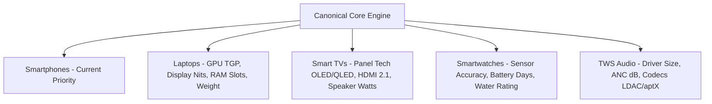

The database and normalization architecture is designed to accommodate new electronics categories by simply defining category-specific `ISpecification` sub-schemas and weight vectors without modifying the core `Product`, `Brand`, `Offer`, or `PriceHistory` entities.

---

## 55. CURRENT DECISIONS

1. **Monorepo Structure:** Structured as a clean monorepo containing `apps/web` (Vite SPA), `apps/api` (Express REST server), and `apps/workers` (BullMQ jobs).
2. **Canonical Identity Model:** All variants are tied to a canonical parent `Product` with strict `[ramGb, storageGb, colorName]` normalization.
3. **Transparent Spec Scoring:** Implemented an open 8-axis formula (0–100) with explainable trade-offs, rejecting black-box scoring.
4. **Zero-Cost Ingestion First:** Bootstrapping the catalog with 250 curated, manually verified smartphones before activating automated API scrapers.
5. **NoSQL Core + Redis Cache:** MongoDB Atlas for document storage and Redis for price tracking queues and rate limiting.

---

## 56. OPEN QUESTIONS

1. *Should we support user-driven price drop SMS / WhatsApp alerts via Twilio / Gupshup, or maintain email-only alerts for the initial phase to control messaging costs?*
2. *Should we provide an EMI calculation widget (3, 6, 9, 12-month tenure with No-Cost EMI indicators) on the PDP during MVP?*

---

## 57. ASSUMPTIONS

1. Initial organic traffic will be mobile-heavy (>75%), requiring extreme prioritization of mobile viewport UX and low JS bundle overhead.
2. Initial affiliate qualification for Amazon India PA-API (3 qualifying sales) will be achieved within 30 days of public launch using standard editorial affiliate links.
3. Factual hardware specifications will be sourced without copyright infringement from official manufacturer public documentation.

---

## 58. RISKS & MITIGATIONS

1. **Risk:** Unannounced retailer API schema changes or affiliate feed delays.
   * *Mitigation:* Resilient fallback caching displaying the last confirmed price with an accurate timestamp.
2. **Risk:** False price drop alerts triggered by seller typographical errors.
   * *Mitigation:* Mathematical -60% single-tick price delta anomaly buffer and 15-minute verification hold.
3. **Risk:** Spec duplication across minor regional phone rebrands (e.g., Poco / Redmi twins).
   * *Mitigation:* Variant and model aliasing table linking rebranded twins with transparent buyer advisories.

---

## 59. NEXT 10 IMPLEMENTATION TASKS

The following tasks are strictly ordered by dependency to begin development immediately following plan review:

1. **[TASK-01 | ARCH-001]:** Initialize repository workspace with TypeScript, ESLint, Prettier, and monorepo structure (`apps/api`, `apps/web`, `apps/workers`, `packages/shared`).
2. **[TASK-02 | DB-001]:** Setup Express API server boilerplate with MongoDB connection, environment validation (Zod), and RFC 7807 error middleware.
3. **[TASK-03 | DB-002]:** Implement Mongoose schemas and compound indexes for `Brand`, `Product`, `ProductVariant`, `Specification`, `Seller`, and `Offer`.
4. **[TASK-04 | DATA-001]:** Create database seed script with 25 landmark Indian benchmark smartphones (Samsung S24 Ultra, OnePlus 12, Redmi Note 13 Pro, iQOO Z9, iPhone 15) with fully normalized specs.
5. **[TASK-05 | DATA-002]:** Implement the `SpecNormalizer` and `ScoreCalculator` utility engines for automated 8-axis spec scoring.
6. **[TASK-06 | API-001]:** Build core REST endpoints for catalog discovery: `GET /api/v1/products` (faceted filters) and `GET /api/v1/products/:slug` (full canonical PDP payload).
7. **[TASK-07 | API-002]:** Build comparison aggregation endpoint: `GET /api/v1/compare?slugs=phone-a,phone-b,phone-c`.
8. **[TASK-08 | FE-001]:** Setup React 19 + Vite + Tailwind CSS frontend with TanStack Query, Lucide Icons, and global responsive layout (Navbar, Footer, Mobile Nav).
9. **[TASK-09 | FE-002]:** Build the high-density Product Detail Page (PDP) featuring Image Gallery, Score Radar/Badges, Key Specs Grid, and Multi-Retailer Price Box.
10. **[TASK-10 | FE-003]:** Build the interactive 2–4 Phone Comparison View with "Highlight Differences Only" toggle and spec-diff summary engine.
